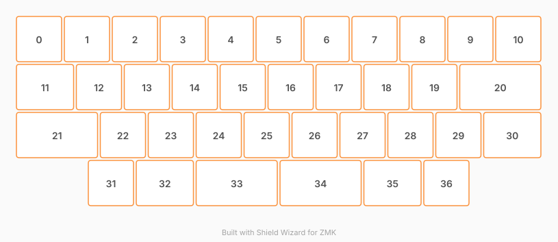

# ZMK Configuration for Osiris

*Generated by Shield Wizard for ZMK*



Download compiled firmware from the Actions tab. <https://zmk.dev/docs/user-setup#installing-the-firmware>

Edit your keymap <https://zmk.dev/docs/keymaps>.
User keymap is located at [`config/osiris.keymap`](config/osiris.keymap).

-----

<details>
<summary>
Shield Wizard Debug Information
</summary>

In case of broken configuration, here is the Shield Wizard internal data used to generate this configuration:

Commit: ab99418c376887d043556e4a1af5a8d1c78d686c

```json
{"name":"Osiris","shield":"osiris","dongle":false,"modules":[],"layout":[{"id":"01M161RFTHQJGH41X66PZ3WCJF","part":0,"row":0,"col":0,"w":1,"h":1,"x":0,"y":0,"r":0,"rx":0,"ry":0},{"id":"01M161RHPE3MV27Z0055CP91WM","part":0,"row":0,"col":1,"w":1,"h":1,"x":1,"y":0,"r":0,"rx":0,"ry":0},{"id":"01M161RJA8AN13179YCE1S2NWX","part":0,"row":0,"col":2,"w":1,"h":1,"x":2,"y":0,"r":0,"rx":0,"ry":0},{"id":"01M161RJPRRQ1ZTNN907SA0ZQW","part":0,"row":0,"col":3,"w":1,"h":1,"x":3,"y":0,"r":0,"rx":0,"ry":0},{"id":"01M161RJXHS148CHP04DKJKZSF","part":0,"row":0,"col":4,"w":1,"h":1,"x":4,"y":0,"r":0,"rx":0,"ry":0},{"id":"01M161RKB25G1R6VE4RFW25JD7","part":0,"row":0,"col":5,"w":1,"h":1,"x":5,"y":0,"r":0,"rx":0,"ry":0},{"id":"01M161RKHBA7ZWYJ6ZK5R9WQ64","part":0,"row":0,"col":6,"w":1,"h":1,"x":6,"y":0,"r":0,"rx":0,"ry":0},{"id":"01M161RKR3YZR0WX4C57SXZ0XN","part":0,"row":0,"col":7,"w":1,"h":1,"x":7,"y":0,"r":0,"rx":0,"ry":0},{"id":"01M161RMCZ43CC7J56BJJVZA1Z","part":0,"row":0,"col":8,"w":1,"h":1,"x":8,"y":0,"r":0,"rx":0,"ry":0},{"id":"01M161RMQC94YTSD2YZCJVM2RZ","part":0,"row":0,"col":9,"w":1,"h":1,"x":9,"y":0,"r":0,"rx":0,"ry":0},{"id":"01M161RN3BE6AZZ1WYFZXXTF7J","part":0,"row":0,"col":10,"w":1,"h":1,"x":10,"y":0,"r":0,"rx":0,"ry":0},{"id":"01M161RWG8B2K84Q4PPD0CFWY1","part":0,"row":1,"col":0,"w":1.25,"h":1,"x":0,"y":1,"r":0,"rx":0,"ry":0},{"id":"01M161XGCAKGJ6MDM61SAFPEAG","part":0,"row":1,"col":1,"w":1,"h":1,"x":1.25,"y":1,"r":0,"rx":0,"ry":0},{"id":"01M1642V7GS05C9CTYS412YMKN","part":0,"row":1,"col":2,"w":1,"h":1,"x":2.25,"y":1,"r":0,"rx":0,"ry":0},{"id":"01M1642Y9MP582EMC458WE34GY","part":0,"row":1,"col":3,"w":1,"h":1,"x":3.25,"y":1,"r":0,"rx":0,"ry":0},{"id":"01M164302CN5ZN7BFDSFTXRWQR","part":0,"row":1,"col":4,"w":1,"h":1,"x":4.25,"y":1,"r":0,"rx":0,"ry":0},{"id":"01M16431M17MWJG25TP6QNF822","part":0,"row":1,"col":5,"w":1,"h":1,"x":5.25,"y":1,"r":0,"rx":0,"ry":0},{"id":"01M16433JX4EXKM38M0EQQYYRX","part":0,"row":1,"col":6,"w":1,"h":1,"x":6.25,"y":1,"r":0,"rx":0,"ry":0},{"id":"01M164352H9DMDHJX5JNACRFRD","part":0,"row":1,"col":7,"w":1,"h":1,"x":7.25,"y":1,"r":0,"rx":0,"ry":0},{"id":"01M16436CZ8G5XKJSWF466TDXJ","part":0,"row":1,"col":8,"w":1,"h":1,"x":8.25,"y":1,"r":0,"rx":0,"ry":0},{"id":"01M164380HXH42A8DYN7QFEKP3","part":0,"row":1,"col":9,"w":1.75,"h":1,"x":9.25,"y":1,"r":0,"rx":0,"ry":0},{"id":"01M1643KZC7R77TQYV872XQWMV","part":0,"row":2,"col":0,"w":1.75,"h":1,"x":0,"y":2,"r":0,"rx":0,"ry":0},{"id":"01M1645ZZ86SXZ9QX1ZPJZBM3C","part":0,"row":2,"col":1,"w":1,"h":1,"x":1.75,"y":2,"r":0,"rx":0,"ry":0},{"id":"01M1646MHXYP3VXVDE03JNQSF5","part":0,"row":2,"col":2,"w":1,"h":1,"x":2.75,"y":2,"r":0,"rx":0,"ry":0},{"id":"01M16472K1APHXMWP1DM73WG0W","part":0,"row":2,"col":3,"w":1,"h":1,"x":3.75,"y":2,"r":0,"rx":0,"ry":0},{"id":"01M16478SCKCW4VSNM32993ABD","part":0,"row":2,"col":4,"w":1,"h":1,"x":4.75,"y":2,"r":0,"rx":0,"ry":0},{"id":"01M1647F1EW74Z11ES2CYNKGF8","part":0,"row":2,"col":5,"w":1,"h":1,"x":5.75,"y":2,"r":0,"rx":0,"ry":0},{"id":"01M1647K35GMXPE89B8B9RN8MJ","part":0,"row":2,"col":6,"w":1,"h":1,"x":6.75,"y":2,"r":0,"rx":0,"ry":0},{"id":"01M1647Q1832SYGHE2WWYJQXS7","part":0,"row":2,"col":7,"w":1,"h":1,"x":7.75,"y":2,"r":0,"rx":0,"ry":0},{"id":"01M1647VKS3WKNVWWND45TWK0Q","part":0,"row":2,"col":8,"w":1,"h":1,"x":8.75,"y":2,"r":0,"rx":0,"ry":0},{"id":"01M16481WRRW5P10MSCTHC66VP","part":0,"row":2,"col":9,"w":1.25,"h":1,"x":9.75,"y":2,"r":0,"rx":0,"ry":0},{"id":"01M1648SDJ623WD7J35755ZQZ7","part":0,"row":3,"col":0,"w":1,"h":1,"x":1.5,"y":3,"r":0,"rx":0,"ry":0},{"id":"01M164BCCEP776RBF6ESH6M52R","part":0,"row":3,"col":1,"w":1.25,"h":1,"x":2.5,"y":3,"r":0,"rx":0,"ry":0},{"id":"01M164C046625R548TZW51M1VS","part":0,"row":3,"col":2,"w":1.75,"h":1,"x":3.75,"y":3,"r":0,"rx":0,"ry":0},{"id":"01M164CHZ55JNGRHHHGYXMZ4JW","part":0,"row":3,"col":3,"w":1.75,"h":1,"x":5.5,"y":3,"r":0,"rx":0,"ry":0},{"id":"01M164CWPY7ND1WP7R0HG0X9F8","part":0,"row":3,"col":4,"w":1.25,"h":1,"x":7.25,"y":3,"r":0,"rx":0,"ry":0},{"id":"01M164D7ARVEGNZENPEW9ND3MH","part":0,"row":3,"col":5,"w":1,"h":1,"x":8.5,"y":3,"r":0,"rx":0,"ry":0}],"parts":[{"name":"unibody","controller":"nice_nano_v2","pins":{"d6":{"usage":"kscan","kscan":"01M1633P320QB93P1FBKTEBDVC","role":"input"},"d5":{"usage":"kscan","kscan":"01M1633P320QB93P1FBKTEBDVC","role":"input"},"d4":{"usage":"kscan","kscan":"01M1633P320QB93P1FBKTEBDVC","role":"input"},"d3":{"usage":"kscan","kscan":"01M1633P320QB93P1FBKTEBDVC","role":"input"},"d7":{"usage":"kscan","kscan":"01M1633P320QB93P1FBKTEBDVC","role":"output"},"d8":{"usage":"kscan","kscan":"01M1633P320QB93P1FBKTEBDVC","role":"output"},"d9":{"usage":"kscan","kscan":"01M1633P320QB93P1FBKTEBDVC","role":"output"},"d21":{"usage":"kscan","kscan":"01M1633P320QB93P1FBKTEBDVC","role":"output"},"d20":{"usage":"kscan","kscan":"01M1633P320QB93P1FBKTEBDVC","role":"output"},"d19":{"usage":"kscan","kscan":"01M1633P320QB93P1FBKTEBDVC","role":"output"},"d18":{"usage":"kscan","kscan":"01M1633P320QB93P1FBKTEBDVC","role":"output"},"d15":{"usage":"kscan","kscan":"01M1633P320QB93P1FBKTEBDVC","role":"output"},"d14":{"usage":"kscan","kscan":"01M1633P320QB93P1FBKTEBDVC","role":"output"},"d16":{"usage":"kscan","kscan":"01M1633P320QB93P1FBKTEBDVC","role":"output"},"d10":{"usage":"kscan","kscan":"01M1633P320QB93P1FBKTEBDVC","role":"output"}},"kscans":[{"kind":"matrix","id":"01M1633P320QB93P1FBKTEBDVC","diodes":true}],"keys":{"01M161RN3BE6AZZ1WYFZXXTF7J":{"input":"d3","output":"d10"},"01M161RMQC94YTSD2YZCJVM2RZ":{"input":"d3","output":"d16"},"01M161RMCZ43CC7J56BJJVZA1Z":{"input":"d3","output":"d14"},"01M161RKR3YZR0WX4C57SXZ0XN":{"input":"d3","output":"d15"},"01M161RKHBA7ZWYJ6ZK5R9WQ64":{"input":"d3","output":"d18"},"01M161RKB25G1R6VE4RFW25JD7":{"input":"d3","output":"d19"},"01M161RJXHS148CHP04DKJKZSF":{"input":"d3","output":"d20"},"01M161RJPRRQ1ZTNN907SA0ZQW":{"input":"d3","output":"d21"},"01M161RFTHQJGH41X66PZ3WCJF":{"input":"d3","output":"d7"},"01M161RWG8B2K84Q4PPD0CFWY1":{"input":"d4","output":"d7"},"01M161RHPE3MV27Z0055CP91WM":{"input":"d3","output":"d8"},"01M161XGCAKGJ6MDM61SAFPEAG":{"input":"d4","output":"d8"},"01M161RJA8AN13179YCE1S2NWX":{"input":"d3","output":"d9"},"01M1642V7GS05C9CTYS412YMKN":{"input":"d4","output":"d9"},"01M1642Y9MP582EMC458WE34GY":{"input":"d4","output":"d21"},"01M164302CN5ZN7BFDSFTXRWQR":{"input":"d4","output":"d20"},"01M16431M17MWJG25TP6QNF822":{"input":"d4","output":"d19"},"01M16433JX4EXKM38M0EQQYYRX":{"input":"d4","output":"d18"},"01M164352H9DMDHJX5JNACRFRD":{"input":"d4","output":"d15"},"01M16436CZ8G5XKJSWF466TDXJ":{"input":"d4","output":"d14"},"01M164380HXH42A8DYN7QFEKP3":{"input":"d4","output":"d10"},"01M1643KZC7R77TQYV872XQWMV":{"input":"d5","output":"d7"},"01M1645ZZ86SXZ9QX1ZPJZBM3C":{"input":"d5","output":"d8"},"01M1646MHXYP3VXVDE03JNQSF5":{"input":"d5","output":"d9"},"01M16472K1APHXMWP1DM73WG0W":{"input":"d5","output":"d21"},"01M16478SCKCW4VSNM32993ABD":{"input":"d5","output":"d19"},"01M1647F1EW74Z11ES2CYNKGF8":{"input":"d5","output":"d18"},"01M1647K35GMXPE89B8B9RN8MJ":{"input":"d5","output":"d15"},"01M1647Q1832SYGHE2WWYJQXS7":{"input":"d5","output":"d14"},"01M1647VKS3WKNVWWND45TWK0Q":{"input":"d5","output":"d16"},"01M16481WRRW5P10MSCTHC66VP":{"input":"d5","output":"d10"},"01M1648SDJ623WD7J35755ZQZ7":{"input":"d6","output":"d8"},"01M164C046625R548TZW51M1VS":{"input":"d6","output":"d20"},"01M164BCCEP776RBF6ESH6M52R":{"input":"d6","output":"d9"},"01M164CHZ55JNGRHHHGYXMZ4JW":{"input":"d6","output":"d18"},"01M164CWPY7ND1WP7R0HG0X9F8":{"input":"d6","output":"d14"},"01M164D7ARVEGNZENPEW9ND3MH":{"input":"d6","output":"d16"}},"encoders":[],"buses":{}}]}
```

</details>
